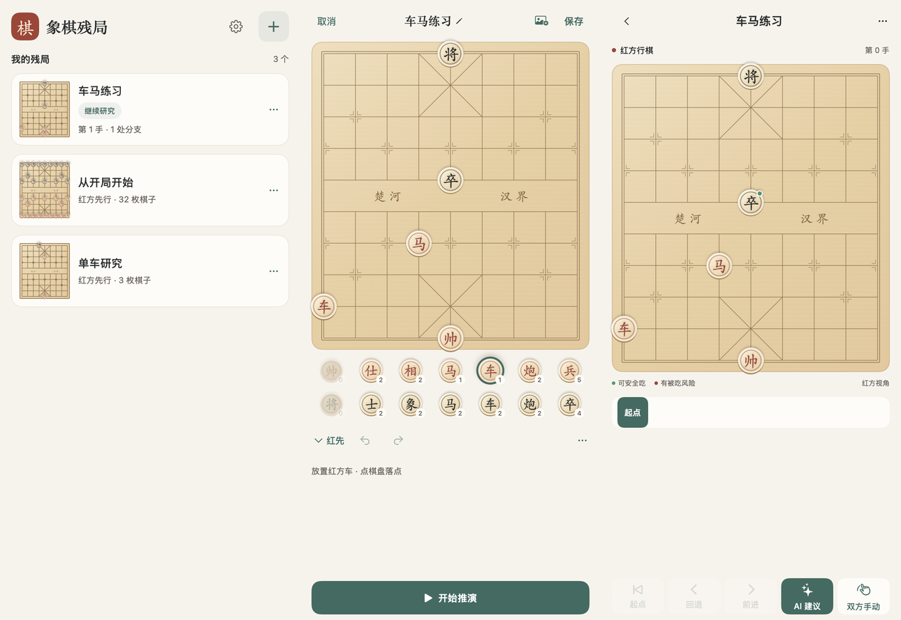

# 象棋残局研究 App

[](https://github.com/ch1y1z1/xiangqi_app/actions/workflows/unsigned-ipa.yml)

面向个人使用的离线象棋残局研究工具，主要支持 iPhone。采用 Swift／SwiftUI 与进程内 Pikafish，初期使用原生 macOS 入口快速开发调试，同时保持 iOS 目标可编译。

## 首版功能

- 自由摆放与删除棋子，选择红先／黑先，保存与查看残局；保存后可编辑棋子和名称。
- 从相册或文件识别棋盘图片，导入后校正与保存；设置中配置 DeepSeek 官方 API 密钥和识别思考强度。
- 默认双方手动推演，回退改走保留多个分支。
- 离线 AI 推荐下一步、采用建议，以及 AI 接管对方。
- 合法落点、上一手、将军与安全吃子红绿灯。
- 默认红方在下，可切换黑方在下；落子动画与 iPhone 震动反馈。

首版优先完成可用闭环，使用 Codable JSON 保存，采用一套浅木棋桌视觉，仅做关键流程验证。

摆棋、保存、推演和皮卡鱼 AI 均离线使用；图片识别是可选的联网功能，仅在点击识别时发送所选图片并消耗 DeepSeek API 额度。密钥保存在本机钥匙串。使用说明见 [图片识别导入](docs/image-import.md)。

## 当前状态与文档

当前已有共享 SwiftUI App 工程，首版核心功能已实现。macOS、iOS 与 iOS Simulator 完整构建通过；关键流程检查在 Mac 和 iOS 26.4 模拟器中通过，模拟器已正常启动 App。真机触摸、震动和性能仍需确认。

- [首版产品规格与页面布局](docs/product-spec.md)
- [开发、构建与运行方法](docs/development.md)
- [IPA 与真机调试](docs/ios-device.md)
- [需求与技术调研报告](docs/xiangqi-ios-research-report.md)
- [引擎探针与复现方法](docs/research/README.md)
- [实际探针结果](docs/research/validation-results.json)
- [首版 App 验证记录](docs/development-validation.json)

已验证保存恢复、多分支、典型红绿灯、包内 NNUE 推荐与取消。页面预览使用实际 SwiftUI 代码离屏渲染，不代表点击／拖动或 iPhone 手感已经验证。



[首版 iPhone 模拟器实际启动画面（2026-10-05）](docs/previews/ios-library.png)。

## 快速开始

```sh
git clone --recurse-submodules https://github.com/ch1y1z1/xiangqi_app.git
cd xiangqi_app
python3 scripts/prepare-engine.py
zsh scripts/build.sh mac
```

需要 Xcode、Python 3 和 7-Zip；已有对应模型时可以向准备脚本传入 `--network`。Mac App 位于 `build/DerivedData/Build/Products/Debug/Xiangqi.app`。

也可以直接从 [最新 GitHub Release](https://github.com/ch1y1z1/xiangqi_app/releases/latest) 下载未签名 IPA、校验文件与对应调试符号。每次分支 push 成功构建后自动发布独立版本，`main` 发布正式版本，其他分支发布预发布版本；连续推送保留每次构建，附件不受 14 天过期限制。安装前需要个人重新签名。

[GitHub Actions](https://github.com/ch1y1z1/xiangqi_app/actions/workflows/unsigned-ipa.yml) 中也保留构建产物 14 天。PR 默认构建 Release，手动触发可选 Debug；这两类运行不自动发版。

## 后续体验确认

在自己的 iPhone 上签名安装，确认一次离线使用闭环、触摸与拖动、动画／震动、切后台和引擎内存。后续按实际体验继续调整，不先增加全面测试体系。

## 许可证与上游

本仓库代码采用 [GPL-3.0](LICENSE)。Pikafish 接入时保留上游许可证、版本与修改记录。

Pikafish 源码通过固定版本 submodule 引入；NNUE 权重不直接提交仓库。权重按[官方独立使用条款](https://github.com/official-pikafish/Networks/blob/master/README.md)管理，资源准备脚本固定对应版本与校验值；构建的 App 已包含离线所需资源。

上游：[Pikafish](https://github.com/official-pikafish/Pikafish)，技术验证固定为 `Pikafish-2026-09-06`。
