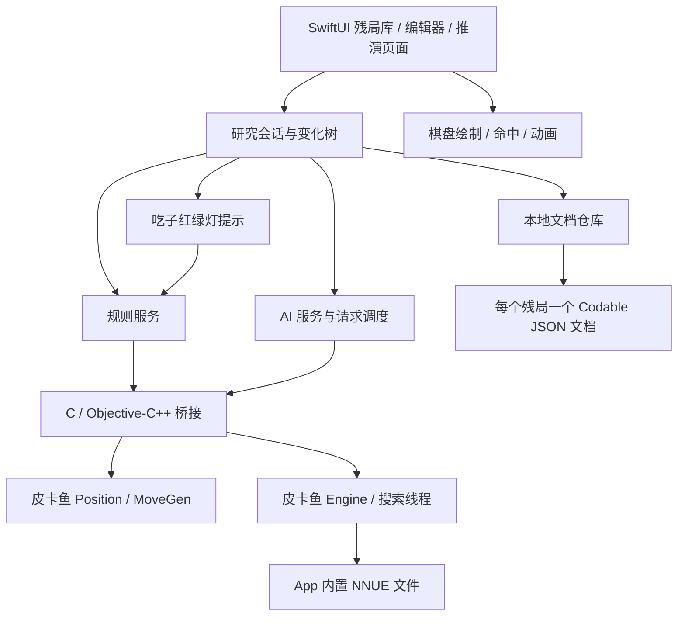

# 离线象棋残局 App：需求讨论与技术方案报告

调研日期：2026-10-05。版本：0.5，已纳入固定棋盘朝向、安全吃子判定、快速开发优先、macOS 初期调试、公开仓库与首版页面规格，以及首版实现与验证状态。

本报告保留调研阶段的方案比较和独立引擎探针证据。后续已按该方案实现共享 SwiftUI App：编辑、保存、多分支推演、离线 AI 推荐／托管与提示均已接入。macOS、iOS 和模拟器完整构建通过，Mac 与 iOS 模拟器中的关键流程检查通过。当前实现和复现方法见 [开发说明](development.md)，实际记录见 [App 验证记录](development-validation.json)。真机体验仍待确认。

## 1. 技术选型结论

**建议首版采用 Swift + SwiftUI，皮卡鱼作为进程内 C++ 库运行。** 棋盘使用自定义绘制和独立棋子视图；个人版直接用 Codable JSON 文件保存研究文档；用一个引擎服务处理推荐和 AI 落子。初期增加原生 macOS 运行入口，共用界面和核心代码，方便在当前 Mac 上快速迭代。

这个判断来自当前的产品重点：主要支持 iOS、棋盘交互需要细致打磨、需要动画与触感、AI 必须离线运行。SwiftUI 负责界面，C++ 负责搜索；不需要服务器。Swift 已支持 C++ 互操作，也可以通过 Objective-C++ 或 C 接口隔离引擎细节。[Swift 官方互操作说明](https://www.swift.org/documentation/cxx-interop/)、[官方支持范围](https://www.swift.org/documentation/cxx-interop/status/)。

建议首版以 **iOS 17+、iPhone 竖屏优先** 为基线；Mac 调试目标以 macOS 14+ 为基线。这是工程建议，并非用户已经确认的设备覆盖范围。若需要兼容更老版本，再调整相关 UI API；当前文件保存方案不依赖 SwiftData。

React Native + TypeScript 是可行的第二选择。如果 Android 也会很快进入首版范围，或者维护团队主要熟悉 React，这个方案的复用优势会变得明显。它仍需编写皮卡鱼原生模块，但原生 C++ 搜索本身不因界面采用 TypeScript 而天然变慢。

用户已确认 **个人使用**；红绿灯提示双方可安全吃掉的无根棋子；推演优先保留多个分支，只有难以实现时才接受单分支。建议按多分支正常实现，红绿灯走轻量规则计算。它们进一步支持原生 iOS 方案：没有商业分发前置事项，日常提示也不必持续运行 NNUE 搜索。

用户已确认：棋盘默认始终红方在下，残局内可选择黑方在下，不随行棋轮次自动翻转；“安全吃子”按合法吃子后没有合法立即回吃判定。为具体化灯的含义，方案按底部一方作为“我方”实现：默认以红方观察，切换黑方在下时以黑方观察。这是对固定观察视角的实现解释，棋盘方向与提示不会随轮次或 AI 托管自动变化。

用户明确要求快速开发。首版先完成摆棋、保存、多分支推演、AI 与提示的闭环；使用一个工程、简单文件保存和少量关键验证，不先建设通用框架、数据库迁移体系或全面测试矩阵。

## 2. 已明确的需求与首版建议

| 能力 | 用户要求 | 首版具体建议 |
| --- | --- | --- |
| 离线 | 全部功能可离线使用 | 引擎、NNUE、字体、声音、棋盘素材全部随包提供，安装后首次进入即可断网使用 |
| 创建残局 | 自由摆放棋子 | 空盘、初始局面两种入口；点击放置与拖动调整；移除、撤销、重做 |
| 先行方 | 红先／黑先 | 编辑器与残局详情明确显示；切换先行方触发重新校验 |
| 保存 | 保存与查看残局 | 名称、缩略棋盘、先行方、修改时间；可改名、复制、删除 |
| 推演 | 默认用户操作双方 | 每次进入默认“双方手动”；严格按当前行棋方走子 |
| AI 推荐 | 推荐下一步 | 显示推荐箭头、中文着法；“采用此步”单独操作；推荐不会自行落子 |
| AI 接管 | 接管对方 | 明确选择“我执红／AI 执黑”或“我执黑／AI 执红”，可随时恢复手动 |
| 提示 | 落点、上一步、吃子红绿灯 | 合法落点与吃子落点区分；上一步起止标记；可安全吃的对方棋子亮绿灯，我方对应危险棋子亮红灯 |
| 体验 | 漂亮、动画、震动 | 原创棋盘与棋子样式；落子与吃子动画；轻量触感；音效与触感可分别关闭 |
| 推演记录 | 优先多分支，困难时可单分支 | 首版按多分支实现，保存当前研究位置，退出后可继续 |
| 棋盘朝向 | 默认红方始终在下，可选黑方在下 | 残局内手动切换；不随行棋或 AI 控制者变化 |
| 导入导出 | 未明确 | 首版暂缓独立导入导出界面；内部 JSON 文档保留后续扩展空间 |

“离线可用”建议按最严格的体验定义：首次启动无需下载模型、无需登录、无需联网校验即可完成摆棋、保存、推演、推荐与 AI 对弈。系统文件分享可能由用户选到云盘，但 App 内的核心功能与本地文件读写不依赖云盘。

## 3. 竞品调研：可以借鉴的内容

此次查看了 App Store 官方介绍、版本记录和官方截图。没有对两个 App 做登录后的完整操作测试，因此不把截图以外的交互细节写成已验证事实。

天天象棋的公开材料呈现出木纹棋盘、易辨识的圆形棋子，以及棋盘配合局势、分析、报告的学习界面。官方介绍包含智能复盘和残局训练。对本产品有价值的是：熟悉的象棋视觉语言、清楚的行棋标记，以及把分析信息放在棋盘周围的布局。[天天象棋 App Store 页面](https://apps.apple.com/cn/app/%E5%A4%A9%E5%A4%A9%E8%B1%A1%E6%A3%8B/id403941510)。

JJ 象棋的公开材料更强调棋子质感、场景与特效；官方截图展示了漏招推演与分析界面，版本记录也提及局内 AI 分析和辅助优化。可以借鉴棋子的拿起与落下反馈、明确的操作状态和推演入口。[JJ 象棋 App Store 页面](https://apps.apple.com/cn/app/jj%E8%B1%A1%E6%A3%8B-%E7%BB%8F%E5%85%B8%E4%B8%AD%E5%9B%BD%E8%B1%A1%E6%A3%8B%E6%B8%B8%E6%88%8F/id979859989)。

**关于“红路灯／红绿灯”：用户已明确所需行为是吃子与有效保护关系提示。** 当前没有足以核实 JJ 完整实现的官方说明，本产品直接以用户给出的定义和下文的边界规则为准。

产品定位建议是“随身的残局研究棋桌”。视觉设计可以保留象棋熟悉的材质和文字，但让研究操作更集中：棋盘、上一手、当前行棋方、变化记录和 AI 建议应当是最容易看到的内容。

## 4. 编辑残局：自由摆放与局面有效性

建议的主流程为：

```text
残局库 → 新建 → 空盘／初始局面 → 摆棋 → 红先／黑先 → 保存 → 开始推演
                       ↑ 草稿自动保存与撤销／重做 ↑
```

编辑器底部放红黑两组棋子托盘，显示各类棋子的剩余数量。点击棋子类型再点击交叉点可以连续放置；拖动已有棋子可调整；“移除”模式或拖回托盘可删除。点击放置与拖动都要支持，减少手指遮住落点的影响。

建议将“自由编辑”和“可推演”分成两种状态：编辑过程中允许缺将、将帅照面等未完成局面，并保存为草稿；点击开始推演时必须通过校验。这样用户可以随意摆棋，又不会把不受支持的局面送给搜索引擎。

校验反馈应使用具体中文，例如“黑方缺少将”“红帅必须在九宫内”“两将之间需要棋子阻隔”。可以定位到相应棋子或区域。用户应能保存未完成草稿，修正后再推演。

**这里有一个产品边界必须说明：皮卡鱼不支持任意违反象棋结构的局面。** 当前版本检查双方各一个将帅、棋子数量上限、部分棋子的合法区域及将帅可被直接吃掉等条件。即使编辑器允许存储“任意摆放”，缺将、超额棋子、士象越界等局面仍不能直接使用原版引擎分析。[皮卡鱼局面校验源码](https://github.com/official-pikafish/Pikafish/blob/Pikafish-2026-09-06/src/position.cpp)。

建议默认按标准数量提供棋子。若希望支持“三辆车”“缺将也继续研究”等特殊玩法，需要作为单独的规则变体评估，不能当作普通残局编辑的小改动。

已经有推演记录的残局，如果修改初始摆子，建议保存为新残局或新的初始版本。旧变化中的走法可能已不合法，不能直接接到新棋盘上。

## 5. 推演与 AI 的行为约定

### 双方手动

默认双方都由用户操作，仍需遵守轮流行棋和合法着法。点击自己的棋子显示落点，再点击目的地落子；点击其他己方棋子切换选中；点击原棋子或空白取消选中。

建议提供“上一手、下一手、返回起点、翻转棋盘”。翻转只改变观察方向，不改变红黑阵营、先行方、内部坐标或分析分数。

### 推荐下一步

点击“AI 建议”后开始有限时搜索。界面先显示思考状态，再显示箭头、中文着法和可展开的后续线路。首版可以默认推荐一条，展开时显示最多三条候选。

推荐结果不直接改变棋盘。“采用此步”才提交走法；在研究模式中，用户也能直接走其他合法着法。推荐中返回上一步、切换分支或退出页面，旧结果必须失效。

### AI 接管对方

开启时明确选择用户执红还是执黑。若此时轮到 AI 方，就立即开始思考；轮到用户方则等待用户走子。界面用文字持续显示哪一方由 AI 操作。

思考时可“停止”或“恢复双方手动”。悔棋或跳转记录时先暂停托管，避免用户刚回退 AI 就立刻把棋走回来；需要用户恢复托管才继续。这个行为是建议默认值，可以调整。

首版托管建议也默认不跨 App 重启自动恢复，重新进入先回到双方手动。保存研究节点与保存自动执行状态应当分别设计。

“思考时间”可以提供快速、标准、深入三档。它表示资源预算，不能直接标成业余几级或某个 Elo。在查看的引擎版本里没有发现现成的 Skill Level／UCI_Elo 选项；真正让 AI 变弱，需要候选着筛选与误差控制，属于另一项功能。[皮卡鱼当前选项实现](https://github.com/official-pikafish/Pikafish/blob/Pikafish-2026-09-06/src/engine.cpp)。

### 变化分支

用户希望优先保留多分支。这个需求的核心数据结构与操作可以直接实现：每个走法节点保存父节点及有序子节点，回退改走新增子节点，而非覆盖后续记录。例如原线路走到第 5 手后回到第 3 手改走，系统生成新变化，原来的第 4、5 手仍可访问。

首版采用“当前线路 + 分支选择器”的界面：有多个下一手时显示变化入口，点击切换；重复走已有着法进入已有分支，避免生成相同的重复子节点。后续可增加整棵树的展示，不影响首版数据结构。没有必要仅因完整树形界面复杂，就退回只能保存一条线路。

首版先完成分支保留、切换与继续研究。节点批注、设为主线、另存当前局面与复杂棋谱树全景可以后续增加；数据结构从第一天采用树即可支持这些扩展。

## 6. 提示与红绿灯方案

| 提示 | 推荐表现 | 是否需要 AI 搜索 |
| --- | --- | --- |
| 选中棋子 | 轻微抬起、明确的选中边框 | 否 |
| 合法空落点 | 小圆点 | 否 |
| 合法吃子落点 | 目标棋子周围的环 | 否 |
| 上一步 | 起点淡标记、终点边框；箭头可切换 | 否 |
| 当前行棋方 | 红方／黑方行棋文字与阵营标记 | 否 |
| 将军 | 将帅高亮，短文字与可选音效 | 否 |
| 将死／困毙 | 结果提示，保留回退与研究入口 | 否 |
| 推荐下一步 | 箭头、着法、后续线路 | 是 |
| 红绿灯 | 对方可安全吃的棋子标绿，我方可被对方安全吃的棋子标红 | 建议不需要；由规则层计算吃子与合法回吃 |

### 已确认含义与判定边界

用户给出的含义为：我方有棋子可以吃掉对方棋子，而且对方棋子无根、我方可以安全吃掉，则显示绿灯；反过来，对方可以安全吃掉我方无根棋子，则显示红灯。

用户已确认把“无有效根／可安全吃”具体实现为：吃子本身合法，模拟吃子后，对方没有合法着法能立即吃回刚落下的棋子。检查的是实际吃子后的棋盘，不能只在原棋盘上数几枚棋子看似保护目标。

| 标记 | 相对观察方的意义 | 标记位置建议 |
| --- | --- | --- |
| 绿灯 | 至少存在一个我方合法吃子，且对方不能立即合法回吃 | 对方目标棋子旁的小绿点／外环 |
| 红灯 | 至少存在一个对方对应的安全吃子，我方棋子存在该风险 | 我方目标棋子旁的小红点／外环 |
| 无灯 | 没有符合条件的吃子关系 | 保留正常棋子样式 |

多个攻击者指向同一棋子时，每条吃子关系分别判断。全盘绿灯表示“至少有一枚棋子可以安全吃”，并不表示所有攻击者都能安全吃。选中具体棋子后只突出它自己的安全吃子目标；点击提示可展示对应攻击者或短箭头。这样不会把某个安全攻击者的结果误套到另一枚棋子上。

将帅的将军状态使用单独提示，不把将帅当作普通可吃目标。编辑器中的未完成非法局面不输出安全吃子结论。

### 为什么要检查合法回吃

- 守子看似保护目标，但移动会暴露己方将帅或形成将帅照面，实际不能回吃，应视为没有该有效保护。
- 炮的炮架、马腿和车的路线会随首次吃子变化，必须按变化后的占位计算。
- 首次吃子不能让自己的将帅受将；若已经被将军，这一步必须同时解将。
- 回吃方如果被将军，只有同时解将的回吃才算有效保护。
- 对方不能立即回吃，不保证数步之后没有反杀或其他损失。若用户希望“安全”还包括整体战术收益，应另加有预算的 AI 校验，不将它默认混入轻量提示。

这个两层检查可以在规则上下文中完成，不需要加载 NNUE、MultiPV 或等待推荐搜索。皮卡鱼自己的长捉实现已经包含模拟吃子再检查合法回吃的过程，可以借鉴底层能力；但不能直接把长捉结果作为红绿灯，因为长捉代码还包含兵卒、将帅、子力与对称攻击等专门例外。[皮卡鱼合法性与长捉源码](https://raw.githubusercontent.com/official-pikafish/Pikafish/Pikafish-2026-09-06/src/position.cpp)。

### 观察视角与轮次

棋盘默认始终红方在下，不随红黑行棋轮次自动翻转；残局中提供“黑方在下”选项。改变朝向不改变先行方、当前行棋方、内部坐标或分支内容。

本方案按底部一方解释灯中的“我方”：红方在下时，红方可安全吃的黑子标绿、可能被黑方安全吃的红子标红；黑方在下时反过来。轮到黑方行棋时，红方在下的含义仍保持不变；启用 AI 接管也不自动切换观察方。这是固定观察视角的实现解释，避免同一棋子仅因轮次改变就交换红绿含义。

提示双方关系时，对非行棋方计算的是当前摆放下的潜在吃子关系，红灯用于提醒风险；正式落子依然只允许当前行棋方行动。算法必须按所分析一方检查其将帅安全。

不能通过在真实会话中走空着，或仅替换 FEN 先行方来计算另一方：将军局面可能因此成为引擎不接受的 FEN。首版已在独立规则副本中实现按阵营查询的吃子辅助函数，不修改真实行棋方、变化树、重复历史或正在搜索的 Engine。无保护目标、有合法回吃、保护者被牵制三类短样例在 Mac 与模拟器中检查通过；未做全面规则穷举。

### 刷新与性能

落子、回退或切分支后，对新的棋盘快照重新计算；选择棋子时过滤已有关系，翻转时重新映射标记颜色。首版先直接计算，只有出现明显延迟才加缓存或异步调度。提示关闭时停止计算，AI 搜索可独立运行。

AI 推荐仍可展示最佳着、候选线路与局面评价。若显示 WDL，应说明它是引擎模型而非用户真实获胜概率；它不参与本功能的红绿灯颜色判定。[官方 WDL 说明](https://github.com/official-pikafish/Pikafish/wiki/UCI-&-Commands)。

## 7. UI 与动效方向

建议首先制作一套“浅木棋桌”：暖白背景、浅木棋盘、朱红与墨黑棋子、细腻边缘与柔和阴影。棋子字形要清晰，材质纹理控制在不影响线条与汉字辨识的程度。首版集中打磨这一套视觉，额外主题与皮肤后续再增加。

残局库采用小棋盘缩略图与名称卡片，顶部放“继续研究”和“新建残局”。编辑页面的视觉中心是棋盘，工具托盘在下方。推演页面的主按钮保持少而明确：回退、前进、AI 建议、托管；次要操作进入菜单。

iPhone 布局建议：顶部名称与行棋状态，中间尽可能大的棋盘，下方当前线路与分析抽屉，最底部操作栏。分析抽屉可以收起，避免压缩棋盘。iPad 若纳入首版，则采用左棋盘、右线路与候选的布局。

棋盘与棋子建议分别绘制：底层 Canvas／Shape 画线条、九宫、河界和标记，独立棋子视图按稳定 ID 移动。Canvas 本身不会为每个画出的棋子提供独立交互与无障碍语义，因此不能把所有操作语义留在一张画布里。[Apple 绘图说明](https://developer.apple.com/documentation/swiftui/drawing-and-graphics)。

| 动作 | 初始动效建议 | 触感建议 |
| --- | --- | --- |
| 选中 | 轻微抬起与边框显现 | 轻选择反馈 |
| 放置／移动 | 约 180–220 ms 移动，落下时收敛 | 轻落子反馈 |
| 吃子 | 被吃棋子短淡出，与落子同步 | 稍重一次 |
| 无效落子 | 短回弹与原因提示 | 轻错误反馈 |
| 将军／结束 | 克制的局部强调 | 可选通知反馈 |
| 浏览记录 | 缩短移动或淡变 | 默认不逐手震动 |

这些时间是设计起点，需要在真机上调整。基础触感可用 UIFeedbackGenerator 的具体子类；若需要更细腻的落子组合，再采用 Core Haptics。[Apple 触感 API](https://developer.apple.com/documentation/uikit/uifeedbackgenerator)、[Core Haptics](https://developer.apple.com/documentation/CoreHaptics)。

红绿灯同时提供形状或文字含义；棋盘命中采用最近交叉点与合理容错。尽量使用系统控件和系统减少动态效果设置，首版不额外安排完整无障碍适配项目。[Apple 颜色指引](https://developer.apple.com/design/human-interface-guidelines/color)、[动态效果指引](https://developer.apple.com/design/human-interface-guidelines/motion)。

## 8. Swift 与 JS／TS 方案比较

以下是针对本项目的工程判断，不是跨平台框架的通用性能排名。

| 方案 | 离线皮卡鱼 | 棋盘与触感 | 开发与维护 | 跨平台价值 | 本项目判断 |
| --- | --- | --- | --- | --- | --- |
| SwiftUI + C++ | 自定义桥接，进程内运行 | 原生动画、手势与触感，32 枚棋子规模可控 | 一套 Apple 工具链；复杂局部可接 UIKit | UI 主要服务 Apple 平台，C++ 核心可复用 | **首选** |
| UIKit + C++ | 同上 | 对自定义绘制、命中和动画有直接控制 | 样板代码较多；细节控制强 | 同上 | 适合已有 UIKit 基础，或棋盘局部使用 |
| React Native + TS + C++ | 自定义 TurboModule／原生模块 | 可采用原生绘制或 Skia；手势与动效需协同设计 | TS、原生代码与框架依赖共同维护 | iOS／Android 可共享较多界面与逻辑 | Android 近期也要发布时优先考虑 |
| React／Vue + Capacitor + C++ | 原生插件承载引擎 | SVG／Canvas 棋盘可做漂亮；触感靠插件 | WebView 与原生两套生命周期需要协调 | Web 与移动 UI 复用明显 | Web 同时是主要产品时更有价值 |
| Web／PWA + WASM | 可行，但需完整缓存与 WASM 适配 | 浏览器手势与触感能力依平台而异 | 模型缓存、线程与浏览器限制额外复杂 | 浏览器覆盖广 | 当前 iOS 目标下不作为首版基线 |

React Native 已正式支持跨平台 C++ 原生模块，TypeScript 声明接口通过 Codegen 接入原生实现。因此它不是必须把搜索算法翻译成 JS。[React Native 官方 C++ 模块指南](https://reactnative.dev/docs/the-new-architecture/pure-cxx-modules)。

如果选择 Expo，需要使用包含自定义原生代码的 development build；Expo Go 不能直接装入新的皮卡鱼模块。生产 JS 与资源随包部署可以离线运行，本产品不需要依赖远程 JS 更新。[Expo 官方自定义原生代码说明](https://docs.expo.dev/workflow/customizing/)。

Capacitor 可用 Swift／Objective-C 插件承载 C++ 引擎，Web 前端只传递 FEN、走法和结果。这样更贴近原生引擎接入；但仍要协调桥接事件、后台切换与存储。[Capacitor iOS 插件指南](https://capacitorjs.com/docs/plugins/ios)。

皮卡鱼新版本已加入 WebAssembly 目标。但多线程 WASM 需要考虑 SharedArrayBuffer、COOP／COEP、Worker 与主线程阻塞，不能仅凭“支持 WASM”就认定 iOS WebView 接入已完成。Capacitor 本地来源如何满足这些条件还需要专项验证。[皮卡鱼发布说明](https://github.com/official-pikafish/Pikafish/releases/tag/Pikafish-2026-09-06)、[Emscripten 线程文档](https://emscripten.org/docs/porting/pthreads.html)。

SwiftUI 足以承载这类 2D 棋盘。建议先采用原生视图与绘图层，在真实交互与性能数据证明有需要时，再把局部绘制切换到 UIKit 或 SpriteKit。

### 初期使用 macOS 目标运行：可行，建议采用

Apple 的 SwiftUI 多平台工程支持使用共享代码构建原生 Mac App；原生 Mac destination 使用 macOS SDK，与 Mac Catalyst 是不同路径。不能仅把任意 iOS 工程的编译平台换成 macOS：UIKit、触感和部分导航 API 需要薄的平台适配。[Apple 多平台目标说明](https://developer.apple.com/documentation/xcode/configuring-a-multiplatform-app-target)。

| 开发路径 | 本项目适用性 | 额外工作 |
| --- | --- | --- |
| 原生 macOS + 共享 SwiftUI | **推荐初期使用**；摆棋、保存、多分支、推荐与托管均可运行 | 隔离少量平台 API；窗口内容先按手机宽度布局 |
| Mac Catalyst | 可用；更适合已有大量 UIKit／iPad 界面的工程 | 启用 iPad／Catalyst 支持，处理相应 API 与界面差异 |
| iOS 模拟器 | 检查移动端布局与流程更接近目标，已安装 runtime 并启动首版 App | 仍不能验证真机触感与手机性能 |

Mac Catalyst 的主要用途是把 iPad App 带到 Mac，本项目尚无 UIKit 工程，从共享 SwiftUI 开始更直接。[Apple Mac Catalyst 文档](https://developer.apple.com/documentation/uikit/mac-catalyst)。

建议一个 Xcode 工程共享 SwiftUI 页面、研究会话、JSON 保存和 C++ 桥接。Mac 入口先使用接近 iPhone 内容尺寸的窗口，触感适配为空操作，不增加桌面菜单、快捷键或独立桌面布局。它是日常开发入口，不另开一条 Mac 产品开发线。

从第一轮开始同时保持 iOS 目标能编译；日常交互在 Mac 上快速调试。核心闭环跑通后，在 iOS 模拟器或真机上集中检查布局、触摸和切后台；震动、引擎峰值内存与实际搜索速度最终用 iPhone 确认。Mac 的成功运行不能替代这些移动端差异的检查，但不必因此阻塞前期界面和功能开发。

独立引擎探针先验证了 Mac 进程内搜索和 iOS 编译／链接。首版开发随后完成了 SwiftUI 多平台工程与平台适配，并另行记录 App 构建、关键流程与模拟器启动结果，见第 15 节。

## 9. 推荐架构与模块职责



| 模块 | 职责 |
| --- | --- |
| XiangqiDomain | 红黑、棋子 ID、90 个交叉点、着法、根局面、变化树、中文记谱 |
| PositionEditor | 自由编辑、托盘数量、草稿、撤销重做、开始推演校验 |
| RulesService | 校验局面、合法着法、执行与撤回、将军、无着可走与规则结果 |
| CaptureHintService | 独立规则副本中的吃子／合法回吃关系、观察方与红绿标记 |
| PikafishBridge | 初始化、资源路径、所有权、C++ 数据复制、错误转换、停止与生命周期 |
| EngineService | 推荐、候选分析、托管请求、优先级、取消、结果有效性 |
| StudySession | 当前节点、行棋方、双方控制者、选择状态、移动事件 |
| StudyRepository | JSON 文档读写、残局列表、明确保存与落子后保存 |
| BoardRenderer | 棋盘、棋子、箭头、提示、屏幕坐标转换与动画 |
| FeedbackService | 音效、触感、减少动态效果与用户设置 |

上表是代码职责划分，不要求每项建独立 package、抽象协议或框架。首版使用一个 Xcode 工程，按 UI、研究数据与会话、引擎桥接三个区域组织代码即可。引擎从固定版本源码编译；不预先建设 XCFramework 发布流程。App 层不直接依赖皮卡鱼内部模板与可变对象。

桥接接口使用明确的请求与结果，例如校验结果、合法着列表、搜索请求、分析事件、停止搜索。C++ 回调中的 `string_view` 等借用数据必须在回调内复制，再传到 Swift；不能直接保留到下一次界面刷新。

**规则层优先复用皮卡鱼的 Position 与 MoveGen。** 它可以提供不需要 NNUE 搜索的合法着判断。编辑器存储未完成棋盘使用独立的简单数据模型；校验成功后才建立规则局面。Swift 不需要再实现一份完整行棋引擎，减少两套规则出现分歧的机会。

## 10. 皮卡鱼接入细节

调研时最新正式版为 **Pikafish-2026-09-06**，验证使用提交 `4c17cee11f888ae1d48a9494f2e2239f019f0a1f`。建议锁定版本、补丁和配套权重，不直接跟随 master。[正式发布页](https://github.com/official-pikafish/Pikafish/releases/tag/Pikafish-2026-09-06)。

发布包中已经有 macOS、Android 等可执行文件，但它们不是可直接塞进 iOS App 使用的库。推荐重新编译 iOS C++ 代码，通过进程内接口调用，而不是运行命令行子进程。

这个版本的 `Engine` 已有设置局面、启动搜索、停止搜索、等待完成和分析回调。建议直接使用这些接口，保留 UCI 的 FEN、着法与分数语义用于互操作和诊断。无需启动 `UCIEngine::loop()`，也无需全局重定向 stdin／stdout。[Engine 接口源码](https://github.com/official-pikafish/Pikafish/blob/Pikafish-2026-09-06/src/engine.h)。

### 资源与初始化

随 App 内置对应 `pikafish.nnue`。本次提取的权重文件为 **50,706,378 字节，约 50.7 MB／48.36 MiB**，SHA-256：

```text
7d13d73569a9b571ba0eb20cf1596247bc2a42738967e61afef6482b231e900e
```

引擎初始化在后台执行，全局攻击表等结构只初始化一次；NNUE 通过 Bundle 提供的绝对路径加载。先检查资源存在、版本与校验值，再开启搜索。文件在包内的大小并不代表运行内存占用。

### 必须处理的错误

命令行 UCI 层遇到某些非法输入会终止进程，而直接调用局面接口可以拿到错误返回。更需要注意：NNUE 加载失败的验证路径仍会调用 `exit()`。本次还发现线程创建与部分分配失败路径存在退出行为，不能假定外层 Swift `do/catch` 能拦住它们。[NNUE 源码](https://raw.githubusercontent.com/official-pikafish/Pikafish/Pikafish-2026-09-06/src/nnue/network.cpp)、[线程源码](https://github.com/official-pikafish/Pikafish/blob/Pikafish-2026-09-06/src/thread.cpp)。

首版只处理实际接入路径上的问题：包内资源检查、非法局面不送入搜索、固定 Hash 与线程配置，以及搜索停止与结果失效。遇到 App 实际可达的主动退出路径再做必要修改；不把穷尽上游全部故障、建设多级降级与重试机制作为前置工作。保存研究的逻辑独立于引擎是否可用。

桌面版还有跨进程共享内存与 Unix socket 服务。首版准备脚本已为编译副本启用引擎已有的本地内存后端，避免 App 启动共享内存服务；包内模型搜索在 iOS 模拟器沙盒检查通过，真机内存仍待观察。[共享内存实现](https://github.com/official-pikafish/Pikafish/blob/Pikafish-2026-09-06/src/shm.h)。

### FEN 与规则历史

统一内部坐标和皮卡鱼的 UCI 坐标，界面翻转只做映射。FEN 中 `w` 对应红方，`b` 对应黑方，需在桥接边界明确转换并测试。

搜索某个分支时传入“初始 FEN + 从根到当前节点的完整着法序列”。单独保存当前 FEN 会丢失重复局面、长将与长捉判断所需的历史。自行摆出的残局无法知道根节点之前的重复历史，首版从研究起点开始计算。

局面与导入走法先在临时规则上下文中验证，再提交给当前研究会话。不能假定引擎设置局面失败时旧上下文完全不变；发生错误后应恢复或重建上下文。中文记谱使用走棋前的局面生成，处理红黑方向与“前／后／中”等同类棋子区分。

推荐返回包含最佳着、候选 PV、分数类型、搜索深度与已用时间的结果。将杀信息单独显示，普通分数在界面统一为红方视角；选择 AI 方不会改变分数显示方向。

## 11. 规则范围

基本合法性必须完整处理：车路线、马腿、象眼与不过河、炮架、九宫、兵卒方向与过河、将帅照面、走后不能自陷将军，以及被将军时的应将。

“无合法着可走”在象棋中判负，包括困毙。这个条件应由规则层直接判定，不应等待 AI 算出很大的负分。[世界象棋联合会的入门说明](https://www.wxf-xiangqi.org/images/free_download_books/xiangqi_introduction_chessplayers_20150323.pdf)。

重复、长将、长捉、自然限着等终局规则带有规则体系差异。皮卡鱼已有相关判断，建议首版研究模式优先与所集成版本的行为一致，并保存规则版本；若用户要求中棋协或世象联某一套完整裁判规则，则需要单独列出样例和验收，而不能笼统称“重复三次就和棋”。[皮卡鱼规则判断实现](https://github.com/official-pikafish/Pikafish/blob/Pikafish-2026-09-06/src/position.cpp)、[世界象棋规则](https://www.wxf-xiangqi.org/images/wxf-rules/2018_World_XiangQi_Rules_English2018.pdf)。

界面应保留“回到前一节点继续研究”的能力。已结束局面的后续探索通过回退或另存为新的起点进行，避免在没有合法着的局面中让 AI 不停请求。

## 12. 本地数据与保存

建议采用一个研究文档作为保存单位，首版直接用 Codable 编解码，每个残局保存为一个 UUID 命名的 JSON 文件，放在 App 的本地 Application Support 目录。个人收藏规模下，启动时读取文档生成列表足够简单；不同时维护数据库、索引与研究树。相较上一版的 SwiftData 方案，这样减少配置和两种数据结构的同步工作，也便于共用 Mac／iOS 代码。

| 数据 | 主要字段 |
| --- | --- |
| StudyRecord | UUID、名称、创建／修改时间、草稿状态、schemaVersion |
| InitialPosition | 初始棋子及稳定 ID、标准化 FEN、先行方、规则版本 |
| StudyNode | UUID、父节点 ID、着法、有序子节点 |
| SessionState | 当前节点 ID、底部阵营、展示设置；观察方由底部阵营确定 |
| AnalysisResult | 当前请求的最佳着、PV、分数与深度；首版只在内存保留 |

相同局面由不同路径到达，不应自动合并为同一树节点；不同的历史可能影响规则判断，也承载不同的用户批注。

用户明确按“保存”时立即写入；推演落子后保存完整文档，切后台与离开页面时补充保存。使用 Foundation 的原子写入选项，界面只在写入成功后显示“已保存”。保存失败给出一次清楚提示，首版不引入备份轮换、事务日志或通用恢复系统。[Apple 文件写入说明](https://developer.apple.com/documentation/foundation/nsdata/writingoptions/atomic)。

首版暂缓导入导出 UI 和格式迁移框架。之后若需要交换残局，可先增加 FEN 与完整 JSON；XQF、CBR 等格式按实际需求扩展。文档保留 schemaVersion，只有真实发生格式变化时再实现对应迁移。

## 13. 搜索调度、内存与耗电

只保留一个负责分析的 Engine 实例。合法着提示使用轻量规则上下文，不为每次点击创建加载 NNUE 的新引擎。先按 **1 搜索线程、32 MiB Hash** 起步，真机测量后再调整。

建议预算起点：快速约 0.3 秒、标准约 1 秒、深入约 3 秒。它们是可配置的产品参数，不是目前已验证的手机性能承诺。红绿灯采用独立规则计算，不占用这些搜索预算。

请求优先级建议为：用户明确的 AI 落子／推荐，高于可选的局势补充分析。托管搜索默认一条 PV，查看多候选时才开启 MultiPV。红绿灯与 AI 使用相互独立的上下文，避免争用可变 Position。

每个请求都携带 studyID、nodeID、完整历史指纹与 generation。落子、回退、切换分支、修改先行方、改变控制者或离开页面都会增加 generation，旧回调即使晚到也不能进入新状态。

引擎控制顺序必须严格：

```text
通知旧搜索停止 → 后台等待它真正结束 → 设置新局面／选项 → 启动新搜索
```

`go()` 非阻塞，`stop()` 设置停止信号；阻塞等待放到专门后台执行器。不能把等待放在主线程，也不能堵住唯一负责发送停止指令的队列。Swift actor 负责请求状态，并不意味着在 actor 内长时间阻塞就安全。

界面分析更新做节流，候选着采用稳定 ID，避免搜索每一层结果都触发棋盘整体重绘。只有用户确认或当前 AI 控制者的有效结果能提交走法。

首版退后台停止搜索并保存会话，回来后由用户继续；不做持续后台分析。先使用固定的轻量搜索预算，额外的温度调节、内存分级与缓存淘汰策略按实际运行问题再增加。销毁引擎前仍需等待搜索结束，这是线程生命周期的基本要求。

本次桌面探针的最大 RSS 为约 **419.5 MiB**，峰值 memory footprint 约 **360.8 MiB**。引擎自身日志报告 NNUE 结构约 64 MiB。加载、临时缓冲、线程结构和哈希表都会增加总占用。这个结果提示必须测量手机峰值；不能按权重文件 50.7 MB 推算 App 内存，也不能把桌面值视为 iPhone 的实际占用。

## 14. 个人使用与安装路径

用户已明确个人使用。当前按本机编译、签名后安装到自己的 iPhone 规划，完整功能仍离线运行。App Store 上架与商业授权不作为当前开发前置事项。

用户已要求在 GitHub 建立公开仓库并在其中持续开发。仓库为 `ch1y1z1/xiangqi_app`；代码采用 GPL-3.0，保留上游来源与许可。公开代码不改变个人设备使用这一产品范围；NNUE 权重仍按独立条款管理。当前首版默认值和三个页面的布局集中记录在 [产品规格](product-spec.md)。

皮卡鱼代码使用 GPLv3。仅在个人设备上私下使用和修改，不会因为这些行为本身就要求公开整个 App 源码；GPL 的相应分发义务在向他人分发时另行处理。[GNU 关于私下修改与使用的说明](https://www.gnu.org/licenses/gpl-faq.en.html#GPLRequireSourcePostedPublic)。

官方 NNUE 条款包含商业使用需许可，当前个人用途按非商业使用设计。工程保留上游许可证、权重来源、固定版本与补丁记录。[官方 NNUE 许可](https://github.com/official-pikafish/Networks/blob/master/README.md)。

安装仍需要 Xcode 中的 Apple Account 与可用签名。免费 Personal Team 可以用于个人设备测试，其安装所用 provisioning profile 会在签发 7 天后过期，届时需重编译、重装。这个周期影响安装维护，不意味着棋盘与 AI 日常运行需要联网。[Apple 个人开发账号说明](https://developer.apple.com/help/account/basics/about-your-developer-account)。

账户、签名与真机连接在实际安装阶段配置；当前不会代替用户选择或登录 Apple Account。若以后改变为分享安装包或商业发布，再按新的实际范围补充分发方案。

## 15. 当前环境与实际验证证据

| 项目 | 本轮观察 |
| --- | --- |
| 工作目录 | 已有公开仓库、共享 SwiftUI App、桥接、固定上游源码与开发脚本 |
| 主机架构 | Apple Silicon，arm64 |
| Xcode | 26.4，build 17E192 |
| Swift | 6.3 |
| SDK | iOS 26.4 与 iOS Simulator 26.4 均可用 |
| Node | 25.9.0；若采用 RN／Capacitor，应按项目锁定支持的 Node 版本 |
| 模拟器 runtime | 已安装 iOS 26.4（23E244）；iPhone 17 Pro 模拟器已启动 App |
| 真机 | 当前没有可用于运行验证的连接设备 |

下面先记录调研阶段的独立引擎探针。验证以固定正式版源码、C++17、ARM64／NEON、iOS 17 deployment target 为基础，排除命令行入口和 universal launcher，包含引擎依赖的 zstd 源码。

| 验证 | 结果 | 证明范围 |
| --- | --- | --- |
| iOS device target | 35 个 C++ 翻译单元全部通过，静态库与探针链接成功 | 核心源码能针对 iOS 编译和链接 |
| iOS simulator target | 同样 35 个全部通过，链接成功 | 当前 arm64 模拟器目标能构建 |
| Mach-O 平台检查 | 分别为 IOS 与 IOSSIMULATOR，minos 17.0，sdk 26.4 | 没有误把 macOS 二进制当成 iOS 构建 |
| macOS 进程内探针 | 正常加载正式版 NNUE，搜索回调与最佳着返回正常 | 验证直接 Engine 调用路径，无 UCI 子进程 |
| 合法性探针 | 初始局面 44 个合法着；空盘、非法走法、将帅照面返回错误 | 部分典型输入与桥接前提得到验证 |
| 推荐／残局／取消 | 初始局面搜索、简化残局搜索、无限搜索的停止均完成 | 关键搜索生命周期在 Mac 上可用 |

本次生成的 iOS 静态库约 1.42 MB，属于 O1 技术探针，不是最终 Release App 包体估计。Mac 测试使用 1 线程、32 MiB Hash、MultiPV 3；250 ms 搜索请求能得到有效输出，取消等待在这次简单局面下小于计时的 1 ms 分辨率。

首版 App 的后续验证结果：

| 验证 | 结果与范围 |
| --- | --- |
| 完整 App 构建 | macOS、iOS device、iOS Simulator 的 Debug 构建通过，包含 SwiftUI、Objective-C++、C++、图标与包内 NNUE |
| Mac 与 iOS 模拟器关键流程 | 合法着法、多分支复用、JSON 保存恢复、草稿校验、三个红绿灯样例、包内模型推荐与取消均通过 |
| 页面布局 | 实际 SwiftUI 三页面离屏渲染；iPhone 17 Pro 模拟器正常启动并截取首页 |
| 桌面资源观察 | 一次 Mac Debug 关键检查最大 RSS 约 437.5 MiB、峰值 memory footprint 约 428.3 MiB；属于短检查，不是 iPhone 性能测量 |

**仍待确认：实际点击／拖动的完整闭环、真机速度与峰值内存、触感、发热、后台切换及个人设备签名安装。** App Store 分发不在当前个人使用范围内。

独立技术探针保存在 `docs/research/`，仅用于复核前期技术结论。产品使用 `Vendor/Pikafish` 固定版本 submodule 与 `Engine/` 桥接；NNUE 由准备脚本下载校验后打包，不提交模型文件。后续 App 记录见 [development-validation.json](development-validation.json)。

## 16. 快速开发顺序与最小验证

| 阶段 | 交付物 | 必要确认 |
| --- | --- | --- |
| A：能运行的研究闭环 | 共享 SwiftUI 工程、浅木棋盘、摆棋、保存、多分支手动推演；Mac 直接运行 | 保存后重进能继续；回退改走保留原分支；iOS 编译通过 |
| B：离线 AI 与提示 | 皮卡鱼桥接、建议与采用、对方托管、落点／上一手／红绿灯 | 推荐能落子；回退或切分支后旧 AI 结果失效；红绿灯符合约定 |
| C：手机体验收尾 | 动画、iOS 触感、触摸与布局调整、个人设备安装 | 手机离线跑通同一流程；看一次引擎峰值内存与搜索响应 |

每个阶段直接交付可运行 App，界面随功能一起打磨，不安排独立的大规模设计确认或测试建设阶段。已有 C++ 探针降低了引擎接入的不确定性，可以先在 Mac 完成闭环，不必等手机专项验证才开始做棋盘。手机检查在核心功能可用后尽早做一次，之后只针对新变化复查。

首版保留三组短验证，优先手动操作；只有遇到难定位的规则或并发问题，才写针对性自动测试：

- **研究闭环：** 红先／黑先摆棋，保存并重开，回退改走后原分支仍在；翻转后行棋方与实际落点不变。
- **AI 与提示：** 一次建议与采用、红黑双方分别托管；思考中回退不会落入旧结果；少量无根、有根与受牵制样例确认红绿灯。
- **iPhone 差异：** 断网跑通上述核心流程，检查手指操作、上下安全区域、动画与震动、切后台，以及一次引擎内存／速度观察。

暂缓收藏／标签、节点批注、全树可视化、多套皮肤、持续分析、导入导出、复杂规则变体、全面无障碍适配、数据迁移／备份框架和完整性能矩阵。这些是额外建议，用户要求的保存、多分支、离线 AI、主要提示、动画和震动仍在首版范围内。

快速开发不会省掉合法走子、有效保存和旧 AI 回调失效等直接影响使用的基本逻辑；这些实现一次即可，无需围绕它们建设通用容错平台。不沿用上一版 4–7 周的完整扩展范围估计，具体节奏以首个可运行版本的实际进展为准。

## 17. 已确认需求与剩余选择

用户已确认：

1. 用途：个人使用。
2. 红绿灯：我方可安全吃掉的对方无根棋子标绿，反向危险标红。
3. 推演保存：优先多个分支，难以实现时允许单分支；方案按多分支推进。
4. 棋盘朝向：默认始终红方在下，残局中可选黑方在下，不自动跟随轮次翻转。
5. 安全吃子：合法吃子后，对方不能立即合法回吃；不要求深层 AI 战术证明。
6. 开发优先级：尽快完成可用 App，减少全面测试、兜底与额外框架工作。

当前采用的工程默认值：原生 SwiftUI，个人 JSON 文档保存，iPhone 优先，浅木棋桌，多分支简洁选择器，Mac 先运行并同时保持 iOS 编译。灯以底部一方为“我方”；这是对固定视角的具体实现解释。自由编辑允许保存草稿，推演前复用皮卡鱼按标准规则校验。

这些默认值可以在看到可运行版本后直接调整，不需要再以完整需求问卷阻塞开发。首版核心功能与三平台构建已完成；下一步在个人 iPhone 上确认实际体验，并按使用反馈继续调整。
